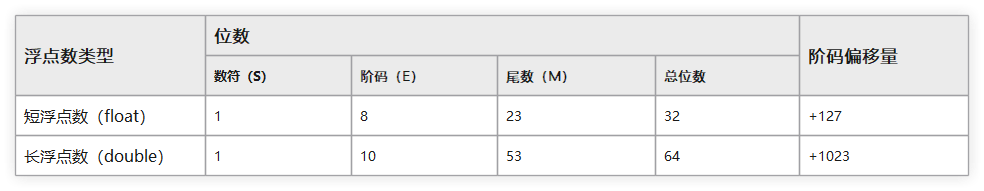

<head>
    <script src="https://cdn.mathjax.org/mathjax/latest/MathJax.js?config=TeX-AMS-MML_HTMLorMML" type="text/javascript"></script>
    <script type="text/x-mathjax-config">
        MathJax.Hub.Config({
            tex2jax: {
            skipTags: ['script', 'noscript', 'style', 'textarea', 'pre'],
            inlineMath: [['$','$']]
            }
        });
    </script>
</head>


# 学而时习之

### `2021-04-15`
> 定点数和浮点数

数字计算机只能处理离散数据，二进制的位数直接决定了它能表示的离散数据个数，也决定了它所能表示的信息个数，对于 $n$ 位二进制数，它可以表示的信息量为 $2^n$。

精度问题：
```python
>>> 6.6 + 1.3
7.8999999999999995
```

实数有两种表示格式，分别是定点数和浮点数，定点数不一定是整数，浮点数不一定是小数。

#### 定点数（fixed point numbers）

定点数约定机器数中的小数点总是固定在某个特定的位置，整数部分和小数部分位长固定，当需要表示绝对值特大或者特小的数需要很大的空间。虽然理论上定点数的小数点的位置可以任意规定，但通常只会用定点数表示 **纯小数** 或 **整数**，计算处理比较方便。

金融/货币计算中，为了保证较高的精度，一般使用定点数据类型，如 NUMERIC、DECIMAL。有时候也直接用整型表示金额，比如将 0.01元实际表示为 1，1.00元表示为 100，整数计算效率高、存储小。

#### 浮点数（floating point numbers）

浮点数使用科学计数法存储数字（格式：符号位 + 指数 + 尾数），小数点的位置根据指数的大小而浮动。


- 符号位 S，就是表整个数字正负的符号，即0和1。

- 阶码 E，也有正负，并且不用真值来表示，通常会用阶码的真值加上一个偏移量，作为实际存储的偏移值。在短浮点数 float 中，这个偏移量为127，假设实际指数为3，则阶码表示为：127 + 3 = 130（二进制：1000 0010）。float 将 1~254 映射到 -126~127 这 254 个有正有负的数上，因为浮点数，不仅仅想要表示很大的数，还希望能够表示很小的数，所以指数位也会有负数。0和255预留出来表示特殊数：0、无穷大、无穷小、NaN。

- 尾数 M（mantissa），或称有效数字（significand）；为了提高精度，规定将原数尾数转化为 `1.xxxx` 的形式，以 1 为默认最高位，然后储存的时候并不储存最高位1，视其为隐藏的，只存储小数点后面的部分，这样可以使尾数表示的精度达到最高，即存储位数最多，比实际位数多一位。

IEEE 754 浮点数的一般格式如下： $N = (-1)^S \* 1.M \* 2^E$。



float 和 double 的精度是由尾数的位数来决定的，$2^{-23} \approx 1.2 * 10^{-7} $，因此 float 的精度为6~7位，同理 double 的精度为15~16位。

#### 定点数和浮点数的区别

- 表示范围：浮点数一部分位为指数，相同位长，浮点数格式所能表示的数值范围远远大于定点数格式。

- 精度大小：浮点数格式只有一部分位是有效数值位，相同位长（比如都用32 bit表示），浮点格式的精度比定点格式低。

- 运算复杂度：浮点数主要包括指数和尾数两部分，运算时需要对阶、尾数计算、规格化等步骤，浮点运算比定点运算复杂。

- 溢出：定点运算在数超过可表示数值范围即发生溢出；在浮点运算中，只有规格化后数值超过指数所能表示的范围才溢出。

<details>
  <summary>参考资料</summary>

  - https://juejin.cn/post/6860445359936798734
  
  - https://segmentfault.com/a/1190000024485146

  - https://blog.csdn.net/sinat_27143551/article/details/103033589

  - https://justjavac.com/codepuzzle/2012/11/02/codepuzzle-float-from-surprised-to-ponder.html

  - https://dev.mysql.com/doc/refman/5.6/en/fixed-point-types.html
  
</details>

### `2021-04-03`
> c++: 表达式中的类型转换

```cpp
int a = 0x7fffffff; // INT_MAX
int b = 2;
double c = a * b; // signed int overflow
```

今天犯了一个低级错误，上例在计算 `a * b` 时会先将结果类型转成 `signed int`，从而产生溢出，正确做法是先对表达式中的操作数预先做强制类型转换：
```cpp
double c = double(a) * b; // or: (double)a * b
```

### `2021-02-23`
> python3: f-string

f-string，即格式化字符串常量（formatted string literals），是Python3.6新引入的一种字符串格式化方法。形式上是以`f`或`F`修饰的字符串（`f'xxx'`或`F'xxx'`），以大括号`{}`标明被替换的字段（大括号内外所用的引号不能冲突，可以分别使用单引号和双引号）。f-string在本质上并不是字符串常量，而是一个在运行时运算求值的表达式。

f-string可以解析str、int、字典、元组、列表、集合等类型，还可以解析函数。

```python
>>> var = 'hello'
>>> f'{var} world' 
'hello world'
>>> num = 24.578 
>>> f'{num:.2f}' 
'24.58'
>>> lt = [1,2,3,4]
>>> f'{sum(lt)}' 
'10'
>>> info = {'name': 'tom', 'age': '20'} 
>>> f'my name is {info["name"]}'
'my name is tom'
```

### `2021-02-22`
> python: 进制转换

`bin`、`oct`、`hex`分别将整数转换成二进制、八进制、十六进制的字符串（`str`）。

```python
>>> bin(0x0f) 
'0b1111'
>>> bin(100)
'0b1100100'
>>> oct(100)
'0o144'
>>> hex(100)
'0x64'
```

`int`可以将其他进制的整数/字符串转换成十进制整数。

```python
>>> 0xf
15
>>> int('0xf')
Traceback (most recent call last):
  File "<stdin>", line 1, in <module>
ValueError: invalid literal for int() with base 10: '0xf'
>>> int('0xf', base=16) 
15
```


### `2021-01-21`
> python2: 编解码错误（UnicodeEncodeError，UnicodeDecodeError）

python2的字符串有`str`和`unicode`两种类型：

```python
s = '关关雎鸠' # type(s): str
u = u'关关雎鸠' # type(u): unicode
```

类型转换：

```python
print s.decode('utf-8')
print u.encode('utf-8')
```

python2认为unicode才是字符的唯一内码，而字符集如gbk、utf8、ascii都是字符的二进制（字节）编码形式。encode：unicode -> gbk等，decode：gbk等 -> unicode。unicode需要**编码**成相应的字符串才能存储（文件）、输出（打印），字符串需要**解码**成unicode对象才能完成拼接（`s+u`）、格式化（`%s`）、求长（`len`）等操作；在进行同时包含`str`和`unicode`的运算时，python2将`str`解码成`unicode`再执行运算。

python2本身不知道`str`类型的编码方式，只能使用`sys.getdefaultencoding()`方式来解码，一般默认为`ascii`，因此对中文不支持。修改方式（全局）：

```python
import sys
reload(sys)
sys.setdefaultencoding('utf-8')
```

print默认将字符打印到标准输出流`sys.stdout`，python2会按照`sys.stdout.encoding`给`unicode`编码之后输出（如果`sys.stdout.encoding='ascii'`，则输出中文会有问题），至于`str`对象，则直接输出（由操作系统解决）。如果python2代码是通过管道/子进程方式运行，`sys.stdout.encoding`会失效为`None`。

使用`codecs`可以改变`sys.stdout.encoding`：

```python
import codecs
UTF8Writer = codecs.getwriter('utf-8')
sys.stdout = UTF8Writer(sys.stdout)
```

但是`codecs`与默认的`sys.stdout`行为相反，它会把`str`对象使用`sys.getdefaultencoding()`方式来解码成`unicode`再输出。

建议：永远使用`u`的形式定义中文字符串。也可通过导入`unicode_literals`包使得默认编码为`unicode`。
```python
>>> from __future__ import unicode_literals
>>> s = '中国'
>>> type(s)
<type 'unicode'>
>>> u = u'中国'
>>> type(u)
<type 'unicode'>
>>> s + u
u'\u4e2d\u56fd\u4e2d\u56fd'
```

另外，python的编译器是默认使用`ascii`解释代码文件，如果源程序中包含中文（字符串、注释等）就会报错。在代码文件的第一行加上`# -*- coding: utf-8 -*-`可指定编码类型以支持中文。

### `2021-01-20`
> 计算机字符集

- ASCII
  - 8个比特（1字节），0-255
  - 为数字、标点、字母、一些符号编码
- GB2312
  - 对ASCII的中文扩展
  - 两个ASCII码大于127的字符连在一起表示一个汉字
  - 为ASCII中的字符都重新用两个字节编码，这就是“全角”字符
  - 原本在127以下的叫“半角”字符
- GBK
  - 对GB2312的扩展
  - 只要求第一个字符大于127，第二个不要求
- Unicode
  - 国际标准组织（ISO）整合了各个国家地区的编码，用16位（两个字节）表示所有字符
    - 半角字符高位补0
  - 一个字符就是两个字节
  - Unicode是一个符号集（character set），没有规定二进制如何存储（如何节省空间，如何让编解码高效）
- UTF
  - 满足计算机网络传输的编码格式
  - utf-8：每次传输8比特数据，还有utf-16、utf-32
  - utf是互联网最广泛使用的Unicode实现方式，是变长编码

例如，汉字“严”的Unicode编码是4e25（十六进制），UTF-8编码是e4b8a5。
```python
>>> u = u'\u4e25'
>>> print u
严
>>> s = u.encode('utf-8')
>>> s
'\xe4\xb8\xa5'
```

### `2020-11-20`
> shell: 批量结束进程

假如要结束`run_demo`指令产生的所有进程，方法如下：

- `ps -ef | grep run_demo | grep -v grep | awk '{print $2}' | xargs kill -9`

  - `ps -ef` 打印当前所有进程的信息

  - `grep run_demo` 筛选目标指令相关进程的信息，以行为单位

  - `grep -v grep` 反向选择，筛选字符串中不包括`grep`的行（`ps -ef`会打印出执行的命令）

  - `awk '{print $2}'` 按默认的空格符分割行，打印分割后的第2个域，即进程号PID

  - `xargs` 将上一个命令的标准输出转换成命令行参数

  - `kill -9 PID` 强制结束进程

- `ps -ef | grep run_demo | grep -v grep | awk '{print "kill -9 " $2}' | bash`

- `killall run_demo`

  - 按进程名结束进程

  - 使用参数`-i`结束前先询问

  - `killall run_*`结束所有以`run_`开头的进程

### `2020-10-26`
> shell: `jobs`

`ctrl+z`将前台正在执行的任务放到后台挂起（`Stopped`）。

`jobs`查看linux中后台任务列表和任务状态：

  - `jobs`命令执行的结果中，`[num]`是后台任务的编号，`+`表示最新的任务，`-`表示第二新的任务，其余没有符号。

  - `jobs -l`可显示任务的进程号pid。

  - 任务状态可以是`Running`、`Stopped`、`Terminated`。

`fg %num`将挂起的任务转为前台执行。

`bg %num`将挂起的任务从状态`Stopped`转为`Running`，仍在后台运行。

`kill %num`或`kill pid`终止后台进程，状态变成`Terminated`。

### `2020-10-09`
> shell: 重定向

shell中常用的文件描述符（file descriptor）有：

  - 0：标准输入（stdin）

  - 1：标准输出（stdout）

  - 2：标准错误（stderr）

标准输出和标准错误默认打印到终端，使用`>`可以进行重定向（覆盖写）：

  - `./run.sh 1> log.txt` 将标准输出重定向到文件log.txt，`1>`可缩写为`>`。

  - `./run.sh 2> err.txt` 将标准错误重定向到文件err.txt。

  - `./run.sh >& log.txt` 将标准输出和标准错误都重定向到文件log.txt。

    - 等价于`./run.sh &> log.txt`

    - 等价于`./run.sh > log.txt 2>&1`

`2>&1`表示将标准错误重定向到标准输出，这里的`&`类似于转义符。需要注意顺序，`./run.sh 2>&1 > log.txt`并不会把标准错误重定向到文件log.txt，因为将标准错误重定向到标准输出时是默认打印到终端的。

`>> log.txt`表示重定向追加到文件log.txt，会保留文件之前的内容；`1>>`和`2>>`同理。


### `2020-09-07`
> shell: `nohup` `&` `&&` `|` `||`

- `nohup ./run.sh`

  - 提示：nohup: ignoring input and appending output to 'nohup.out'
  - run.sh的输出不会出现在前台
  - 响应SIGINT信号，Ctrl+C可以中止程序
  - 免疫SIGHUP信号，关闭session（终端窗口）不会杀死程序
  - 可以通过kill杀死程序：`killall run.sh`
  - 查看进程：`ps -ef | grep 'run.sh'`

- `./run.sh &`

  - 后台运行，会显示进程号；默认输出到屏幕
  - 通过`jobs`和`fg`切换到前台运行
  - 免疫SIGINT信号，Ctrl+C不可以中止程序
  - 响应SIGHUP信号，关闭session（终端窗口）可以杀死程序

- `nohup ./run.sh &`
  - 后台运行，会显示进程号，前台无输出
  - 同时免疫SIGINT信号和SIGHUP信号
  - 只能通过kill中止程序：`killall run.sh`
  - 重定向输出：`nohup ./run.sh > log 2>&1 &`

- `&&`

  - 串联指令，前一条命令执行成功，才执行后一条

- `|`

  - 管道，上一条命令的输出作为下一条的输入

- `||`

  - 上一条命令执行失败，才执行下一条

### `2020-09-05`
> vi/vim快捷键

- 查找

  - `/term` 向（光标）后查找，`?term` 向前查找
    - `n` 下一个
    - `N` 上一个

- 替换

  - `:%s/old_term/new_term/g`

  - `:%s/term//gn` 匹配个数（`n`表示预览指令效果，不会实际执行）

- 复制粘贴

  - `Y` 或 `yy` 复制整行
  - `P` 粘贴至上行
  - `p` 粘贴至下行

- 删除

  - `D` 从光标删除至行尾
  - `dd` 剪切（删除）整行
  - `3dd` 向下删除3行

- 翻阅

  - `Ctrl+F` 后翻
  - `Ctrl+B` 前翻

- 行号

  - `:set number` 显示行号
  - `:set nonumber` 取消行号


### `2020-08-19`
> python偏函数：`funtools.partial`

```python
def partial(func, /, *args, **keywords):
    def newfunc(*fargs, **fkeywords):
        newkeywords = {**keywords, **fkeywords}
        return func(*args, *fargs, **newkeywords)
    newfunc.func = func
    newfunc.args = args
    newfunc.keywords = keywords
    return newfunc
```
`partial`的作用是部分使用某个函数，即冻结住某个函数的某些参数（\*args, **keywords），让它们保证为某个值，并生成一个可调用的新函数对象（newfunc），这样就能够直接调用该函数对象，并且仅使用很少的参数（\*fargs, **fkeywords）。
```python
>>> def foo(a, b, key=True):                    
...     if key: return a*b                        
...     else: return -1*a*b                          
...                                             
>>> pa = functools.partial(foo, b=-1, key=True) 
>>> list(map(pa, [1,2,3]))                      
[-1, -2, -3]                                       
```

被`partial`装饰的函数配合`map`使用（比如tensorflow的`map_fn`），只需要给定单一输入（例中为参数a）。

### `2020-08-11`
> 分卷压缩

- **rar**

  - 压缩，每个分卷最大为50MB。
    ```bash
    rar a -v50m out.rar oxf.mat
    ```

  - 解压
    ```bash
    unrar x out.part1.rar
    ```

- **zip**

  - 压缩，每个分卷最大为50MB。
    ```bash
    zip out.zip oxf.mat
    zip -s 50m out.zip --out partout
    ```

  - 解压
    ```bash
    cat partout.z* > partout_re.zip
    unzip partout_re.zip
    ```

- **tar** 

  - 压缩，每个分卷最大为50MB。
    ```bash
    tar czvf out.tar.gz oxf.mat
    split -d -b 50m out.tar.gz
    ```

  - 解压
    ```bash
    cat x* > out_x.tar.gz
    tar zxvf out_x.tar.gz
    ```

### `2020-08-08`
> python `pickle`

pickle模块实现了用于序列化和反序列化Python对象结构的二进制协议。pickle模块只能在Python中使用，几乎所有的数据类型（列表、字典、集合、类等）都可以用pickle来序列化，以二进制的形式序列化后保存到文件中（.pkl），不能直接打开进行预览。

以下函数基于Python 3.8。

- `pickle.dump(obj, file, protocol=None, *, fix_imports=True, buffer_callback=None)`

  将数据序列化后存入文件（'wb'）。

- `pickle.load(file, *, fix_imports=True, encoding="ASCII", errors="strict", buffers=None)`

  将文件的内容反序列化读出（'rb'），此时要让Python能够找到数据对应的类的定义。

- `pickle.dumps(obj, protocol=None, *, fix_imports=True, buffer_callback=None)`

  将对象序列化为bytes形式，而不是存入文件。

- `pickle.loads(data, *, fix_imports=True, encoding="ASCII", errors="strict", buffers=None)`

  从bytes中读取序列化前的对象。

> python3 `bytes`

bytes以字节序列的形式（二进制形式）存储数据，不关心数据的具体形式（字符串、图像、视频）和内容。

通过encode和decode，bytes和字符串（`str`，unicode）可以相互转换。

在将字符串存入磁盘和从磁盘读取字符串的过程中，Python自动完成了编码和解码；使用bytes类型，则是自己指定编解码方式。

```python
>>> bytes("hello world", encoding="utf8")
b'hello world'
>>> "hello world".encode("utf8")
b'hello world'
>>> "hello world".encode("utf8").decode("utf8")
'hello world'

>>> a = bytes("hello world", encoding="utf8")
>>> a[0]         
104              
>>> a[1]         
101              
>>> len(a)       
11               
>>> a[:5]        
b'hello'             
>>> type(a)      
<class 'bytes'>  
```

> 协同过滤

协同过滤（Collaborative Filtering）是一种在推荐系统中广泛使用的技术。该技术通过分析**用户**或者**事物**之间的相似性（“协同”），来预测用户可能感兴趣的内容并将其推荐给用户。这里的相似性可以是人口特征（性别、年龄、居住地等）的相似性，也可以是历史浏览内容的相似性（比如都关注过和中餐相关的内容）等。比如，用户A和B都是居住在北京的年龄在20-30岁的女性，并且都关注过化妆品和衣物相关的内容，这种情况下，协同过滤可能会认为A和B相似程度很高，于是可能会把A关注但B没有关注的内容推荐给B，反之亦然。

- 基于存量（Memory-based）的协同过滤
  - 基于用户（User-based）的协同过滤

    - 收集用户信息。
    
    - 最近邻搜索(Nearest neighbor search, NNS)，计算用户之间的相似度。

    - 产生推荐结果。例如：透过对A用户的最近邻用户进行统计，选择出现频率高且在A用户的评分项目中不存在的推荐给A。

  - 基于项目（Item-based）的协同过滤
    
    基本假设：能够引起用户兴趣的项目，必定与其之前评分高的项目相似。

    - 收集用户信息。

    - 针对项目的最近邻搜索，计算项目之间的相似度。

    - 产生推荐结果。由于未考虑用户间的差别，所以精度比较差。但是却不需要用户的历史数据，或是进行用户识别。对于项目来讲，它们之间的相似性要稳定很多，因此可以离线完成工作量最大的相似性计算步骤，从而降低了在线计算量，提高推荐效率。

- 基于模型（Model-based）的协同过滤
  
  以存量为基础（Memory-based）的协同过滤的缺点是数据稀疏，难以处理大数据量，这会影响即时结果。以模型为基础的协同过滤是先用历史数据得到一个模型，再用此模型进行预测。

- 优点

  推荐个性化、自动化程度高，能够有效的利用其他相似用户的反馈信息，加快个性化学习的速度。

- 缺点

  新用户问题（New User Problem），系统开始时推荐质量较差；新项目问题（New Item Problem），质量取决于历史数据集；稀疏性问题（Sparsity）；系统扩展性问题（Scalability）。

### `2020-06-01`
> F12

在网页按F12，点击箭头可选择网页内容进行编辑，但是每次编辑都要用箭头重新选择。在console输入：`document.body.contentEditable="true"`就可以对任意内容进行编辑了。

F12可以用来查找网页中图片、视频的下载地址。

### `2020-03-19`
> python `isinstance`

`isinstance(object, classinfo)` 函数来判断一个对象是否是一个已知的类型，`classinfo`可以是元组。`isinstance()` 会认为子类是一种父类类型，考虑继承关系，而 `type()`不考虑继承。

```python
>>> a = 2
>>> isinstance(a, (int, str))
True
>>> class A(object):
...     pass
...
>>> class B(A):
...     pass
...
>>> b = B()
>>> isinstance(b, A)
True
>>> type(b) == A
False
```

> python `zip`

`zip([iterable, ...])` 将对象中对应的元素打包成一个个元组，然后返回由这些元组组成的列表。

利用`*`号操作符，可以将元组解压为列表。

```python
>>> a = [1,2,3]
>>> b = [5,6,7,8]
>>> zipped = zip(a, b)
>>> zipped
<zip object at 0x7fde6fa9f780>
>>> list(zipped)
[(1, 5), (2, 6), (3, 7)]
>>> list(zipped) ## 只能取一次值
[]
>>> unzipped = zip(*list(zipped))
>>> list(unzipped)
[(1, 2, 3), (5, 6, 7)]
```

### `2020-03-09`
> 进程和线程

`程序（program）`是指令、数据及其组织形式的描述，`进程（process）`是程序的真正运行实例。若干进程有可能与同一个程序相关系，且每个进程皆可以同步（循序）或异步（平行）的方式独立运行。

`线程（thread）`是操作系统能够进行运算调度的最小单位。大部分情况下，它被包含在进程之中，是进程中的实际运作单位。一条线程指的是进程中一个单一顺序的控制流，一个进程中可以并发多个线程，每条线程并行执行不同的任务。

- 不同进程间数据很难共享。
- 同一进程下不同线程间数据很容易共享，多线程技术：每一个线程都代表一个进程内的一个独立执行上下文。
- 进程使用的内存地址可以上锁，即一个线程使用某些共享内存时，其他线程必须等它结束才能使用这一块内存。
- 进程间不会相互影响、更加安全稳定，而一个线程挂掉将导致整个进程挂掉。
- 多进程创建销毁、切换复杂速度慢，多线程可以进行快速创建和数据共享。

**并行（parallel）**：在同一时刻，有多条指令在多个处理器上同时执行。无论从微观还是从宏观来看，二者都是一起执行的。

**并发（concurrency）**：在同一时刻，只能有一条指令执行，但多个进程指令被快速的轮换执行，使得在宏观上具有多个进程同时执行的效果，但在微观上并不是同时执行的，只是把时间分成若干段，使多个进程快速交替地执行（时间片轮转进程调度算法）。


### `2020-02-29`
> python `vars`

`vars`函数返回对象的属性和属性值对应的字典对象。

```python
class Info(object):
    def __init__(self, age, sex):
        self.age = age
        self.sex = sex

class User(object):
    def __init__(self, name, info):
        self.name = name
        self.info = info

info = Info(25, 'man')
print(vars(info))
print(vars(User('fong', info)))
print(vars(User('fong', vars(info))))
```

```
{'age': 25, 'sex': 'man'}
{'name': 'fong', 'info': <__main__.Info object at 0x000001987824A490>}
{'name': 'fong', 'info': {'age': 25, 'sex': 'man'}}
```

注意最后两行的差异，正确的初始化应该使用`vars`以匹配`**kwargs`字典参数。

### `2020-02-27`
> python `h5py`

h5py文件是存放两类对象的容器：dataset和group。dataset是数据项；group是像文件夹一样的容器，类似于字典，有键和值；group中可以存放dataset或者其他group。

```python
import numpy as np
import h5py
fw = h5py.File("test.hdf5", 'w')

g = fw.create_group("grp")
d = fw.create_dataset("dst", data=np.random.random([3,5]))

g_sub = g.create_group("grp-sub")
g["grp-dst"] = 5

print(fw.keys())
# <KeysViewHDF5 ['dst', 'grp']>
print(fw['dst'][()]) ## value
print(g['grp-sub'].name)
# /grp/grp-sub
print(g['grp-dst'].shape, g['grp-dst'].dtype, g["grp-dst"][()])
# () int32 5

fw.close()
```

```
fw
├── dst
└── grp
    ├── grp-dst
    └── grp-sub
```

### `2020-02-27`
> python缓存装饰器：`functools.lru_cache`

LRU，即Least Recently Used，最近最少使用，是一种常用的页面置换算法，选择最近最久未使用的页面予以淘汰。

`lru_cache`根据参数缓存每次函数调用结果，对于相同参数的，无需重新函数计算，直接返回之前缓存的返回值。`maxsize`指定了缓存的长度，`typed=True`则不同类型的函数参数将单独缓存，例如，f(3)和f(3.0)将视为不同的调用。

```python
import functools

@functools.lru_cache(maxsize=128, typed=False)
def fibonacci(n:int) -> int:
    if n == 0: return 0
    elif n == 1: return 1
    elif n > 1: 
        return fibonacci(n-2) + fibonacci(n-1)
```

### `2020-01-14`
> `HSL`和`HSV`色彩空间

`HSL`和`HSV`都是一种将`RGB`色彩模型中的点描述在圆柱坐标系中的表示法。这两种表示法试图做到比基于笛卡尔坐标系的几何结构`RGB`更加**直观**。

这个圆柱的中心轴取值为自底部的黑色到顶部的白色而在它们中间的是灰色，绕这个轴的角度对应于“色相”，到这个轴的距离对应于“饱和度”，而沿着这个轴的高度对应于“亮度”或“明度”。

`HSL`即色相、饱和度、亮度（Hue, Saturation, Lightness），又称`HSI`（Hue, Saturation, Intensity）。这三个维度是相互独立的，而`RGB`三个维度不是独立的。

`HSV`即色相、饱和度、明度（Hue, Saturation, Value），又称`HSB`（Hue, Saturation, Brightness）。

- 色相（H）是色彩的基本属性，就是平常所说的颜色名称，如红色、黄色等。
- 饱和度（S）是指色彩的纯度，越高色彩越纯，低则逐渐变灰，取 0 - 100% 的数值。
- 明度（V）、亮度（L），取 0 - 100% 。


- `HSV` 的 V（明度）控制纯色中混入黑色的量，越往上，值越大，黑色越少，颜色明度越高。
- `HSV` 的 S（饱和度）控制纯色中混入白色的量，越往右，值越大，白色越少，颜色纯度越高。
- `HSL` 的 L（亮度），从下至上，混入的黑色逐渐减少，直到 50% 位置处完全没有黑色，也没有白色，纯度达到最高；继续往上，纯色混入的白色逐渐增加，到达最高点变为纯白色，明度最高。
- 两个表示法在数学上都是圆柱，但`HSV`在概念上可以被认为是颜色的倒圆锥体（黑点在下顶点，白色在上底面圆心），`HSL`在概念上可以被认为是一个双圆锥体或圆球体（白色在上顶点，黑色在下顶点，最大横切面的圆心是半程灰色）。注意：尽管在`HSL`和`HSV`中“色相”指称相同的性质，但是它们的“饱和度”的定义是明显不同的。
- Photoshop颜色选择器采用`HSV`；Windows操作系统颜色选择器采用`HSL`。

### `2020-01-09`
> HTTP协议常见代码

- `1xx` 临时响应，需要请求者继续执行操作
  - `100 Continue` 请求已被服务器接收，浏览器应继续发送请求的其余部分。
  
- `2xx` 请求被成功处理。
  - `200 Ok` 一切正常。

- `3xx` 重定向
  - `301 Permanently Moved` 请求的网页已永久移动到新位置，自动将请求者转到新位置。
  
- `4xx` 请求错误
  - `400 Bad Request` 请求出现语法错误。
  - `403 Forbidden` 资源不可用，服务器理解客户的需求，但是拒绝处理，通常由于服务器上文件或目录的权限设置问题。
  - `404 Not Found` 无法找到指定位置的资源。
  - `410 Gone` 请求的资源已永久删除。
  
- `5xx` 服务器错误
  - `500 Internal Server Error` 服务器遇到了意料不到的情况，不能完成客户的请求。
  - `502 Bad Gateway` 服务器作为网关或代理，从上游服务器收到无效响应。
  - `503 Service Unavilable` 服务器由于维护或者负载过重未能应答。
  - `504 Gateway Timeout` 作为代理或网关服务器使用，表示不能及时地从远程服务器获得应答。

### `2020-01-05`
> python `os.walk`

```python
os.walk(top, topdown=True, onerror=None, followlinks=False)
```

`os.walk`是目录树生成（directory tree generator）函数，通过在目录树中游走输出 `top` 目录下的所有目录及文件；返回一个生成器，每一个元素是一个三元组：(root, dirs, files)，类型是 (string, list, list)。

```
root
├── a.txt
├── b.txt
└── fa
    ├── aa.txt
    ├── ab.txt
    └── faa
        └── aaa.txt
```

以上目录树返回的结果转换成 list 之后是：
```
[('root', ['fa'], ['a.txt', 'b.txt']), 
('root/fa', ['faa'], ['aa.txt', 'ab.txt']), 
('root/fa/faa', [], ['aaa.txt'])]
```

### `2020-01-01`
> shell `^M`

运行 shell 脚本文件报错，出现 `^M` 字样，是因为编辑脚本文件是在 Windows 系统下进行的，导致shell 脚本文件是 dos 格式，即每一行结尾以 `\r\n` 来标识，而 unix 格式的文件行尾则以 `\n` 来标识。

解决方案
- 使用 `dos2unix sh_file` 指令。

- 用 vim 打开该脚本文件；输入 `:set ff?`，若输出 `fileformat＝dos` 可以判定是格式问题；输入 `:set fileformat=unix` 即可。

### `2019-12-27`
> 欧拉数$e$

$$e = \sum_{n=0}^{+\infty} \frac{1}{n!} = \lim_{n \to +\infty} (1+\frac{1}{n})^n \approx 2.7183 $$

- 假设银行一年复利为$r$，一年按$n$次计算复利，每次利率为$\frac{r}{n}$，当$n \to +\infty$，一年的收益率为
  
  $$(1+\frac{r}{n})^n \approx e^r. $$

- 对含$n$个样本的数据进行$n$次有放回均匀采样，当$n \to +\infty$，有

  $$ (1-\frac{1}{n})^n \approx \frac{1}{e} \approx 36.8\% $$

  的样本从未被选中。

# 光影留声

## 影
> 陪伴我的成长

- **电视剧**
  
  - `神雕侠侣 1995`

    

    亦正亦邪的杨过。

  - `齐天大圣 1996`

    

    “话说另一头，猪八戒可就惨咯。”

    印象很深的是三打白骨精那集，悟空分身向师父跪拜。

  - `西游记 1998`

    

    通臂猿猴很威；唐僧的形象很饱满。
  
  - `水浒传 1998`

    

    李雪健老师演得非常好，浔阳楼题反诗，一镜到底；王思懿很漂亮。

  - `上错花轿嫁对郎 2001`

    

    杜冰雁！

  - `寻秦记 2001`

    

    第一部穿越剧，也是古天乐在tvb的最后一部电视剧。

    男一男二都很黑。

  - `天下第一 2005`

    

    海棠很漂亮，飘絮很漂亮，雪姬很漂亮。。。

  - `亮剑 2005`

    

    狭路相逢勇者胜。

  - `闯关东 2008`

    

    家国情怀。

- **电影**

  - `A计划 1983`

    
    
    “胖子，你很面熟啊。”
    
    “我的脸又没被开水烫过，怎么会熟呢？”

  - `警察故事系列 1985`

    

    龙叔一直都很拼。

  - `英雄本色系列 1986`

    

    “我要争一口气，不是想证明我有多么了不起，我是要告诉别人，我失去的东西我一定要拿回来!”

  - `倩女幽魂系列 1987`

    

    把恐怖片拍成喜剧。

  - `黄飞鸿系列 1991`

    

    自带BGM的黄飞鸿。

  - `都市情缘 1994`

    

    剧情很感人。（香江第一靓仔）

  - `大话西游 1995`

    

    爱情悲喜剧。

  - `蜀山传 2001`

    

    郑伊健、张柏芝、古天乐、章子怡、吴京、林熙蕾 ... 高颜值。

  - `无间道系列 2002`

    

    “我想做个好人。”
    
    ...
    
    “对不起，我是警察。”

  - `天下无双 2002`

    

    开头黄梅调的天仙配，很喜庆（过年时候看的）。

  - `寒战系列 2012`

    

    近年来难得的港式警匪片。

    天王魅力依旧。

## 声

{:.table}
| **影视剧** | **年份** | **曲目** |
| --------- | ----- |----------- |
| `射雕英雄传` | 1983 | 《铁血丹心》《世间始终你好》《一生有意义》（罗文/甄妮） |
| `雪山飞狐` | 1985 | 《雪山飞狐》（吕方/关菊瑛） |
| `英雄本色` | 1986 | 《当年情》（张国荣） |
| `西游记` | 1986 | 《云宫迅音》（许镜清）；《敢问路在何方》（蒋大为）； 《女儿情》（吴静）；《通天大道宽又阔》（崔京浩）|
| `封神榜` | 1990 | 《神的传说》（谭咏麟）；《独占潇洒》（屠洪刚） |
| `雪山飞狐` | 1991 | 《追梦人》（凤飞飞） |
| `鹿鼎记` | 1992 | 《开心做出戏》（黄霑） |
| `壹号皇庭` | 1992 | 《壹号皇庭主题音乐》 |
| `太极张三丰` | 1993 | 《偷功》（胡伟立）；《随缘》（罗大佑） |
| `新白娘子传奇` | 1993 |《千年等一回》（高胜美）；《渡情》（左宏元/张慧清）|
| `三国演义` | 1994 |《滚滚长江东逝水》（杨洪基）；《历史的天空》（毛阿敏）|
| `大话西游` | 1995 |《小刀会序曲》（商易）；《西天取经路遥迢》（赵季平）|
| `神雕侠侣` | 1995 |《神话情话》（周华健/齐豫）；《归去来》（胡兵/希莉娜依）；《英雄的黎明》（横山菁儿）；《雨夜诀别》（赵季平）|
| `齐天大圣` | 1996 | 《西游记》《天外有天》《法术乌魔多》《把酒狂歌》（张卫健） |
| `笑傲江湖` | 1996 | 《活得潇洒》（谭咏麟/陈慧娴） |
| `康熙微服私访记` | 1997 |《江山无限》（屠洪刚）；《百姓的事儿牵着走》（戴娆） |
| `天龙八部` | 1997 |《难念的经》（周华健）|
| `太极宗师` | 1997 |《英雄谁属》（卞留念）|
| `中华小当家` | 1997 |《空》（大黒摩季）；《万里长城》|
| `苗翠花` | 1997 |《小小女子半边天》（李乐诗）|
| `东游记` | 1998 |《逍遥游》（吴佳明）|
| `鹿鼎记` | 1998 |《叱咤红人》（陈小春）|
| `西游记2` | 1998 | 《取一念》《遇强越强》（陈浩民）；《只爱西经》（洪健华） |
| `还珠格格` | 1998 | 《当》（动力火车）；《不能和你分手》《有一个姑娘》（赵薇）；《齿轮》（唢呐插曲，赵薇）；《雨蝶》（李翊君） |
| `人龙传说` | 1999 |《人龙传说》（陈浩民）|
| `西游记动画` | 1999 |《猴哥》《一个师傅三个徒弟》（张伟进）；《振奋的悟空》|
| `水浒传` | 1998 |《天时地利人和》（彭丽媛）；《好汉歌》（刘欢）；《王进打高俅》（赵季平） |
| `西游记后传` | 2000 | 《我欲成仙》（刘欢）；《相思》（毛阿敏） |
| `少年包青天` | 2000 | 《无愧于心》（孙楠）；《只要有你》（那英/孙楠） |
|`春光灿烂猪八戒`| 2000 |《好春光》（吴彤）；《卷睫盼》（吴彤/陈琳） |
| `侠客行` | 2001 | 《纵横江湖》（洪勇） |
| `上错花轿嫁对郎` | 2001 | 《巧解姻缘天作合》（陈倩倩）；《烟雨唱扬州》（李殊） |
| `封神榜` | 2001 |《封神》（陈浩民/刘玉翠）；《每一生都等你》（陈洁仪）|
| `寻秦记` | 2001 |《天命最高》《我愿爱》（古天乐）|
| `倚天屠龙记` | 2001 |《风起云涌》（吴启华）|
| `笑傲江湖` | 2001 | 《笑傲江湖》（刘欢/王菲） |
| `大汉天子` | 2002 |《守业更比创业难》（景岗山）|
| `孟丽君` | 2002 |《忘记时间》（林峯）；《再生花》（陈慧琳）|
| `倚天屠龙记` | 2003 |《心爱》（金学峰）|
| `至尊红颜` | 2003 | 《至尊红颜》（张克帆） |
| `孝庄秘史` | 2003 |《你》（屠洪刚）；《美人吟》（李玲玉） |
| `穿越时空的爱恋` | 2003 |《太多》《就让你走》（陈冠蒲） |
| `神探狄仁杰` | 2004 | 《长歌一曲》（腾格尔） |
| `天涯侠医` | 2004 | 《心呼吸》（林峯） |
| `大唐双龙传` | 2004 | 《双子龙》（林峯） |
| `连城诀` | 2004 | 《我们站在雨中》（韩磊） |
| `功夫` | 2004 | 《只要为你活一天》（刘家昌）；《闯将令》（于会咏/胡登跳） |
| `花姑子` | 2004 | 《舞飞飏》（含笑）|
| `天下第一` | 2005 | 《天下第一》（麦振鸿） |
| `家有儿女` | 2005 | 《阳光男孩阳光女孩》（TG4） |
| `快乐星球` | 2005 | 《快乐小神仙》（天唱组合）；《月亮船》（王英姿） |
| `神雕侠侣` | 2006 | 《天下无双》（张靓颖） |
| `笑傲江湖` | 2006 | 《江湖笑》（周华健） |
| `金枝欲孽` | 2006 | 《儿女》（林保怡） |
| `贞观长歌` | 2007 | 《贞观长歌》（张澜澜） |
| `闯关东` | 2008 | 《家园》（刘欢/宋祖英） |
| `仙剑奇侠传三` | 2009 | 《生生世世爱》（吴雨霏）；《忘记时间》（胡歌）；《此生不换》（青鸟飞鱼）；《偏爱》（张芸京）；《落入凡尘》（麦振鸿） |


## 音

> 配音演员也是幕后英雄

{:.table}
| **国配（男）** | **演员** |
| ------------ |----------- |
| `张佩山` | 李小龙 |
| `张佩儒` | 成龙（醉拳，蛇形刁手，奇迹），洪金宝（福星系列），黄日华（射雕英雄传） |
| `张济平` | 周润发（英雄本色），成龙（A计划）|
| `冯雪锐` | 狄龙（英雄本色），周润发（纵横四海），元彪（A计划），李修贤（喋血双雄），李连杰（黄飞鸿之壮志凌云）|
| `叶清` | 刘德华（无间道），陈冠希（无间道），陈浩民（天龙八部，人龙传说），tvb西游记旁白 |
| `张艺` | 梁朝伟（无间道），古天乐（寻秦记），陈锦鸿（创世纪，搜神传，雪山飞狐），林峯（谈情说案，使徒行者），陈浩民（西游记2，tvb封神榜）|
| `姜小亮` | 成龙（双龙会），李连杰（倚天屠龙记），周星驰（新精武门），张国荣（金玉满堂）|
| `黄河` | 黄日华（天龙八部），吴镇宇（倚天屠龙记），刘德华（新上海滩），郭政鸿（tvb西游记）|
| `杜燕歌` | 古天乐（神雕侠侣，圆月弯刀），江华（苗翠花），樊少皇（天龙八部），吕颂贤（笑傲江湖），tvb封神榜旁白|
| `杜德勋` | 周润发（监狱风云，和平饭店，大丈夫日记，精装追女仔）|
| `黎泓和` | 黎耀祥（tvb西游记），郭晋安（古灵精探），刘德华（决战紫禁之巅），梁朝伟（天下无双），古天乐（宝贝计划），林峯（少年四大名捕），李国麟（天龙八部）|
| `赵恩余` | 罗家英（大话西游），曾志伟（无间道）|
| `李自学` | 李连杰（黄飞鸿之狮王争霸），梁家辉（新龙门客栈）|
| `胡立成` | 吴孟达（赌侠，鹿鼎记，大话西游，武状元苏乞儿）|
| `石班瑜` | 周星驰（赌侠，鹿鼎记，大话西游，武状元苏乞儿）|
| `李香生` | 郑伊健（暗战，古惑仔），何家劲（包青天），邹兆龙（九品芝麻官），蟹老板（海绵宝宝）|
| `孙大川` | 刘德华（天下无贼，十面埋伏，未来警察，狄仁杰，新少林寺，寒战，盲探，富春山居图）|
| `齐炎` | 梁朝伟（鹿鼎记，杨家将）|
| `徐健春` | 刘德华（赌神，赌侠，整蛊专家），吴启华（九品芝麻官），梁家仁（唐伯虎点秋香）|
| `孙德成` | 周润发（赌神），九品芝麻官旁白，黄百鸣（开心鬼系列），成龙（飞龙猛将），张国荣（倩女幽魂）|
| `卢琨` | 林峯（寻秦记，孟丽君，大唐双龙传，覆雨翻云，布衣神相），古天乐（天地男儿），陈小春（鹿鼎记）|
| `刘印生` | 欧阳震华（醉打金枝，洗冤录），刘家辉（95神雕侠侣）|
| `孙烟超` | 黎耀祥（神雕侠侣），元华（寻秦记）|
| `许秉珩` | 马国明（古灵精探，回到三国，飞虎）|
| `刘一飞` | 麦长青（天龙八部，tvb西游记）|
| `徐敏` | 古天乐（蜀山传），成龙（新警察故事，宝贝计划），张国荣（枪王，东邪西毒），黎明（赌神3）|
| `郭如舜` | 刘德华（雷洛传，与龙共舞，赌城大亨，战神传说），李连杰（方世玉），苏有朋（还珠格格，无敌县令）|
| `张秋冰` | 成龙（警察故事，福星系列，龙的心），张国荣（英雄本色），钟镇涛（富贵列车）|
| `屈中恒` | 李连杰（中南海保镖，精武英雄，新少林五祖，鼠胆龙威）|

{:.table}
| **国配（女）** | **演员** |
| ------------ |----------- |
| `韩冬青` | 张曼玉（双龙会），邱淑贞（倚天屠龙记），张敏（天龙八部）|
| `廖静妮` | 翁美玲（射雕英雄传），林青霞（东方不败，刀马旦），关之琳（黄飞鸿）|
| `苏柏丽` | 温碧霞（tvb封神榜），佘诗曼（金枝欲孽），宣萱（寻秦记）|
| `邢金沙` | 叶璇（tvb封神榜），朱茵（射雕英雄传），黎姿（金枝欲孽），刘玉翠（天龙八部）|
| `晏晓陶` | 唐宁（大唐双龙传），李莫愁（95神雕侠侣），张可颐（金枝欲孽）|
| `小小` | 苑琼丹（tvb封神榜），陈松伶（金装四大才子，天地男儿），李绮红（95神雕侠侣）|
| `潘宁` | 郭羡妮（寻秦记），傅明宪（95神雕侠侣），李若彤（天龙八部）|
| `邵凯丽` | 钟嘉欣（溏心风暴之家好月圆，搜神传），徐子珊（少年四大名捕）|
| `刘小芸` | 张敏（武状元苏乞儿），巩俐（唐伯虎点秋香），周慧敏（伦文叙老点柳先开），袁咏仪（国产凌凌漆）|
| `于小华` | 李若彤（95神雕侠侣）|
| `周莹` | 杨怡（大唐双龙传），滕丽名（寻秦记）|

## 央视

- `我爱你，中国（弦乐版）`
  
  徐鲤

- `春节序曲`，`步步高`

  央视春晚背景音乐

- `舌尖上的中国`

- `航拍中国`

# 2008 大事记

> 关键词：`众志成城`，`多难兴邦`。

- 年初，南方特大雪灾冰灾，交通瘫痪，很多人回不了家过年。

- 2月5日，“感动中国2007年度十大人物”揭晓，钱学森——民族脊梁。

- 3月14日，西藏发生大规模打砸抢烧暴力事件。

- 5月12日14时28分4.0秒四川汶川发生8.0级大地震；截至2008年9月25日12时，汶川地震已确认69277人遇难，374643人受伤，失踪17923人；国务院决定5月19日至21日全国哀悼日。

- 8月8日，第29届北京奥运会开幕；《北京欢迎你》广为传唱；中国队51枚金牌位列金牌榜首位。

- 9月1日，全国范围内全面免除城市义务教育阶段学生学杂费。

- 9月9日，三鹿奶粉事件爆发。

- 9月25日，神舟七号载人飞船发射成功。

- 全球金融危机。

# 归去来兮

归去来兮，田园将芜胡不归？
既自以心为形役，奚惆怅而独悲？悟已往之不谏，知来者之可追。
实迷途其未远，觉今是而昨非。舟遥遥以轻飏，风飘飘而吹衣。问征夫以前路，恨晨光之熹微。

乃瞻衡宇，载欣载奔。僮仆欢迎，稚子候门。三径就荒，松菊犹存。携幼入室，有酒盈樽。引壶觞以自酌，眄庭柯以怡颜。倚南窗以寄傲，审容膝之易安。园日涉以成趣，门虽设而常关。策扶老以流憩，时矫首而遐观。云无心以出岫，鸟倦飞而知还。景翳翳以将入，抚孤松而盘桓。

归去来兮，请息交以绝游。世与我而相违，复驾言兮焉求？悦亲戚之情话，乐琴书以消忧。农人告余以春及，将有事于西畴。或命巾车，或棹孤舟。既窈窕以寻壑，亦崎岖而经丘。木欣欣以向荣，泉涓涓而始流。善万物之得时，感吾生之行休。

已矣乎！寓形宇内复几时？曷不委心任去留？胡为乎遑遑欲何之？富贵非吾愿，帝乡不可期。怀良辰以孤往，或植杖而耘耔。登东皋以舒啸，临清流而赋诗。聊乘化以归尽，乐夫天命复奚疑！

# 行云流水

## 2020

`2020-07-26` 入职。

`2020-06-28` 再见，科大。

`2020-06-02` 毕业论文视频答辩。

`2020-05-31` 返校。原定的开学日期是02-08。

`2020-01-23` 武汉“封城”。新型冠状病毒肺炎疫情给全国敲响警钟。

`2020-01-09` 合肥初雪。

## 2019

`2019-11-20` 爷爷去世了。老人家操劳了一辈子，累了一辈子，拉扯大这么多人真的不容易。以前想着要带爷爷去旅游，看看外边的世界，现在，没有机会了。

## 2018

`2018-08-29` 去华为实习了。

`2018-08-03` MM论文被接收了，很幸运。

## 2017

`2017-09-01` 研究生入学，做的方向是图像检索。

`2017-07-01` 毕业啦。

`2017-06-18` 和室友去黄山玩。

## 2015

`2015-07-10` 参加西安交大C9暑期交流。

## 2014

`2014-10-02` 去南京玩了。

`2014-05-10` 转到电子工程与信息科学系。

## 2013

`2013-08-15` 军训，开始大学生活。在工试2班，有一群快乐的小伙伴。


