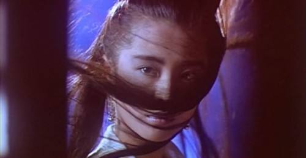
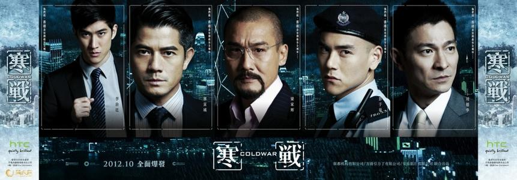

# 学而时习之

# 光影留声

## 影
> 我觉得好看就行，不在乎别人的评价

- **电视剧**

  - `神雕侠侣`

    

    1995古天乐版。

    亦正亦邪的杨过。

  - `齐天大圣`

    

    1996张卫健版西游记。

    “话说另一头，猪八戒可就惨咯。”

    印象很深的是三打白骨精那集，悟空分身向师父跪拜。

  - `西游记2`

    

    1998陈浩民版。

    通臂猿猴很威；唐僧的形象很饱满。
  
  - `水浒传`

    

    1998央视版。

    李雪健老师演得非常好，浔阳楼题反诗，一镜到底；王思懿很漂亮。

  - `上错花轿嫁对郎`

    

    2001。

    杜冰雁惊艳！

  - `寻秦记`

    

    2001。

    第一部穿越剧，也是古天乐在tvb的最后一部电视剧。

    男一男二都很黑。

  - `天下第一`

    

    2005。

    海棠很漂亮，飘絮很漂亮，雪姬很漂亮。。。

  - `亮剑`

    

    2005。

    狭路相逢勇者胜。

  - `闯关东`

    

    2008。

    家国情怀。

- **电影**

  - `A计划`

    

    1983。
    
    “胖子，你很面熟啊。”
    
    “我的脸又没被开水烫过，怎么会熟呢？”

  - `警察故事系列`

    

    1985。

    龙叔一直都很拼。

  - `英雄本色系列`

    

    1986。

    “我要争一口气，不是想证明我有多么了不起，我是要告诉别人，我失去的东西我一定要拿回来!”

  - `倩女幽魂系列`

    

    1987。

    把恐怖片拍成喜剧。

  - `黄飞鸿系列`

    

    1991。

    自带BGM的黄飞鸿。

  - `都市情缘`

    

    1994。

    剧情很感人。（黎明太帅了！）

  - `大话西游`

    

    1995。

    爱情悲喜剧。

  - `蜀山传`

    

    2001。

    郑伊健、张柏芝、古天乐、章子怡、吴京、林熙蕾 ... 高颜值。

  - `无间道系列`

    

    2002。

    “我想做个好人。”
    
    ...
    
    “对不起，我是警察。”

  - `天下无双`

    

    2002。

    开头黄梅调的天仙配，很喜庆（过年时候看的）。

  - `寒战系列`

    

    2012。

    近年来难得的港式警匪片。

    两大天王魅力依旧。

## 声

{:.table}
| **影视剧** | **年份** | **曲目** |
| --------- | ----- |----------- |
| `射雕英雄传` | 1983 | 《铁血丹心》《世间始终你好》《一生有意义》（罗文/甄妮） |
| `英雄本色` | 1986 | 《当年情》（张国荣） |
| `西游记` | 1986 | 《云宫迅音》（许镜清）；《敢问路在何方》（蒋大为）； 《女儿情》（吴静）；《通天大道宽又阔》（崔京浩）|
| `封神榜` | 1990 | 《神的传说》（谭咏麟）；《独占潇洒》（屠洪刚） |
| `鹿鼎记` | 1992 | 《开心做出戏》（黄霑） |
| `新白娘子传奇` | 1993 |《千年等一回》（高胜美）；《渡情》（左宏元/张慧清）|
| `三国演义` | 1994 |《滚滚长江东逝水》（杨洪基）；《历史的天空》（毛阿敏）|
| `神雕侠侣` | 1995 |《神话情话》（周华健/齐豫）；《归去来》（胡兵/希莉娜依）|
| `齐天大圣` | 1996 | 《西游记》《天外有天》《法术乌魔多》《把酒狂歌》（张卫健） |
| `笑傲江湖` | 1996 | 《活得潇洒》（谭咏麟/陈慧娴） |
| `康熙微服私访记` | 1997 |《江山无限》（屠洪刚）；《百姓的事儿牵着走》（戴娆） |
| `天龙八部` | 1997 |《难念的经》（周华健）|
| `太极宗师` | 1997 |《英雄谁属》（卞留念）|
| `中华小当家` | 1997 |《空》（大黒摩季）；《万里长城》|
| `东游记` | 1998 |《逍遥游》（吴佳明）|
| `鹿鼎记` | 1998 |《叱咤红人》（陈小春）|
| `西游记2` | 1998 | 《取一念》《遇强越强》（陈浩民）；《只爱西经》（洪健华） |
| `还珠格格` | 1998 | 《当》（动力火车）；《不能和你分手》《有一个姑娘》（赵薇）；《雨蝶》（李翊君） |
| `人龙传说` | 1999 |《人龙传说》（陈浩民）|
| `西游记` | 1999 |《猴哥》《一个师傅三个徒弟》（张伟进）|
| `水浒传` | 1998 |《天时地利人和》（彭丽媛）；《好汉歌》（刘欢） |
| `西游记后传` | 2000 | 《我欲成仙》（刘欢）；《相思》（毛阿敏） |
| `少年包青天` | 2000 | 《无愧于心》（孙楠）；《只要有你》（那英/孙楠） |
|`春光灿烂猪八戒`| 2000 |《好春光》（吴彤）；《卷睫盼》（吴彤/陈琳） |
| `侠客行` | 2001 | 《纵横江湖》（洪勇） |
| `上错花轿嫁对郎` | 2001 | 《巧解姻缘天作合》（陈倩倩）；《烟雨唱扬州》（李殊） |
| `封神榜` | 2001 |《封神》（陈浩民/刘玉翠）；《每一生都等你》（陈洁仪）|
| `寻秦记` | 2001 |《天命最高》《我愿爱》（古天乐）|
| `倚天屠龙记` | 2001 |《风起云涌》（吴启华）|
| `大汉天子` | 2002 |《守业更比创业难》（景岗山）|
| `孟丽君` | 2002 |《忘记时间》（林峯）|
| `至尊红颜` | 2003 | 《至尊红颜》（张克帆） |
| `孝庄秘史` | 2003 |《你》（屠洪刚）；《美人吟》（李玲玉） |
| `穿越时空的爱恋` | 2003 |《太多》《就让你走》（陈冠蒲） |
| `神探狄仁杰` | 2004 | 《长歌一曲》（腾格尔） |
| `天涯侠医` | 2004 | 《心呼吸》（林峯） |
| `大唐双龙传` | 2004 | 《双子龙》（林峯） |
| `连城诀` | 2004 | 《我们站在雨中》（韩磊） |
| `功夫` | 2004 | 《只要为你活一天》（刘家昌） |
| `天下第一` | 2005 | 《天下第一》（麦振鸿） |
| `家有儿女` | 2005 | 《阳光男孩阳光女孩》（TG4） |
| `快乐星球` | 2005 | 《快乐小神仙》（天唱组合）；《月亮船》（王英姿） |
| `神雕侠侣` | 2006 | 《天下无双》（张靓颖） |
| `笑傲江湖` | 2006 | 《江湖笑》（周华健） |
| `金枝欲孽` | 2006 | 《儿女》（林保怡） |
| `贞观长歌` | 2007 | 《贞观长歌》（张澜澜） |
| `闯关东` | 2008 | 《家园》（刘欢/宋祖英） |
| `仙剑奇侠传三` | 2009 | 《忘记时间》（胡歌）；《此生不换》（青鸟飞鱼）；《偏爱》（张芸京）；《落入凡尘》（麦振鸿） |

## 音

> 配音演员也是幕后英雄

{:.table}
| **国配（男）** | **演员** |
| ------------ |----------- |
| `张佩山` | 李小龙 |
| `张佩儒` | 成龙（醉拳，蛇形刁手，奇迹），洪金宝（福星系列），黄日华（射雕英雄传） |
| `张济平` | 周润发（英雄本色），成龙（A计划）|
| `冯雪锐` | 狄龙（英雄本色），周润发（纵横四海）|
| `叶清` | 刘德华（无间道），陈冠希（无间道），陈浩民（天龙八部，人龙传说），tvb西游记旁白 |
| `张艺` | 梁朝伟（无间道），古天乐（寻秦记），陈锦鸿（创世纪，搜神传，雪山飞狐），林峯（谈情说案，使徒行者），陈浩民（西游记2，tvb封神榜）|
| `姜小亮` | 成龙（双龙会），李连杰（倚天屠龙记），周星驰（新精武门）|
| `黄河` | 黄日华（天龙八部），吴镇宇（倚天屠龙记），刘德华（新上海滩）|
| `杜燕歌` | 古天乐（神雕侠侣），江华（苗翠花），tvb封神榜旁白|
| `杜德勋` | 周润发（监狱风云，和平饭店，大丈夫日记，精装追女仔）|
| `黎泓和` | 黎耀祥（tvb西游记），郭晋安（古灵精探），刘德华（决战紫禁之巅），梁朝伟（天下无双），古天乐（宝贝计划）|
| `赵恩余` | 罗家英（大话西游），曾志伟（无间道）|
| `李自学` | 李连杰（黄飞鸿），梁家辉（新龙门客栈）|
| `胡立成` | 吴孟达（赌侠，鹿鼎记，大话西游，武状元苏乞儿）|
| `石班瑜` | 周星驰（赌侠，鹿鼎记，大话西游，武状元苏乞儿）|
| `李香生` | 郑伊健（暗战，古惑仔），何家劲（包青天），邹兆龙（九品芝麻官），蟹老板（海绵宝宝）|
| `孙大川` | 刘德华（天下无贼，十面埋伏，未来警察，狄仁杰，新少林寺，寒战，盲探，富春山居图）|
| `齐炎` | 刘德华（雷洛传）|
| `卢琨` | 林峯（寻秦记，孟丽君，大唐双龙传，覆雨翻云，布衣神相），古天乐（天地男儿），陈小春（鹿鼎记）|

{:.table}
| **国配（女）** | **演员** |
| ------------ |----------- |
| `廖静妮` | 翁美玲（射雕英雄传） |
| `邵凯丽` | 钟嘉欣（溏心风暴） |
| `韩冬青` | 张曼玉，邱淑贞（倚天屠龙记），张敏（天龙八部）|
| `廖静妮` | 林青霞（东方不败，刀马旦），关之琳（黄飞鸿）|
| `苏柏丽` | 温碧霞（tvb封神榜），佘诗曼（金枝欲孽），宣萱（寻秦记）|
| `邢金沙` | 叶璇（tvb封神榜），朱茵（射雕英雄传），黎姿（金枝欲孽），刘玉翠（天龙八部）|
| `晏晓陶` | 唐宁（大唐双龙传），李莫愁（神雕侠侣）|
| `小小` | 苑琼丹（tvb封神榜），陈松伶（金装四大才子，天地男儿）|

# 2008 大事记

> 认识两个词：`众志成城`，`多难兴邦`。

- 年初，南方特大雪灾冰灾，交通瘫痪，很多人回不了家过年。

- 2月5日，“感动中国2007年度十大人物”揭晓，钱学森——民族脊梁。

- 3月14日，西藏发生大规模打砸抢烧暴力事件。

- 5月12日14时28分4.0秒四川汶川发生8.0级大地震；截至2008年9月25日12时，汶川地震已确认69277人遇难，374643人受伤，失踪17923人；国务院决定5月19日至21日全国哀悼日。

- 8月8日，第29届北京奥运会开幕；《北京欢迎你》广为传唱；中国队51枚金牌位列金牌榜首位。

- 9月1日，全国范围内全面免除城市义务教育阶段学生学杂费。

- 9月9日，三鹿奶粉事件爆发。

- 9月25日，神舟七号载人飞船发射成功。

- 全球金融危机。

# 行云流水

## 2019

`2019-11-20` 爷爷去世了。老人家操劳了一辈子，累了一辈子，拉扯大这么多人真的不容易。以前想着要带爷爷去旅游，看看外边的世界，现在，没有机会了。

## 2018

`2018-08-29` 去华为实习了。

`2018-08-03` MM论文被接收了，很幸运。

## 2017

`2017-09-01` 研究生入学，做的方向是图像检索。

`2017-07-01` 毕业啦。

## 2014

`2014-05-10` 转到电子工程与信息科学系。

## 2013

`2013-08-15` 军训，开始大学生活。在工试2班，有一群快乐的小伙伴。

